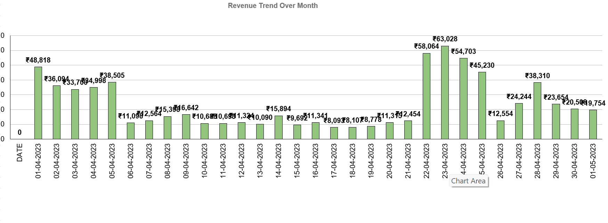
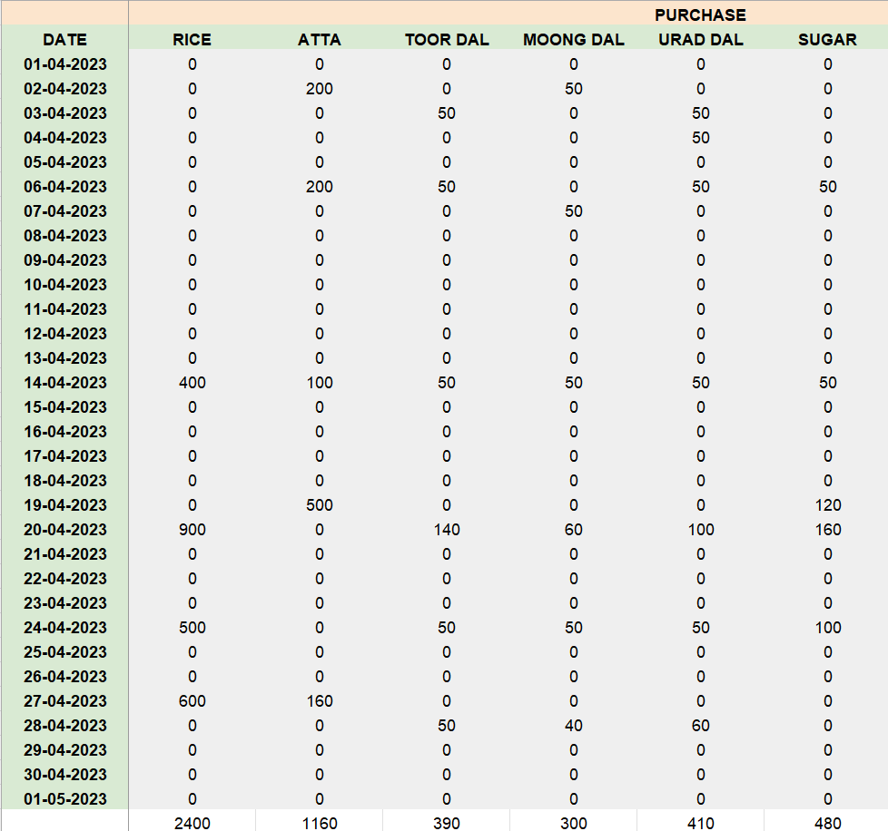
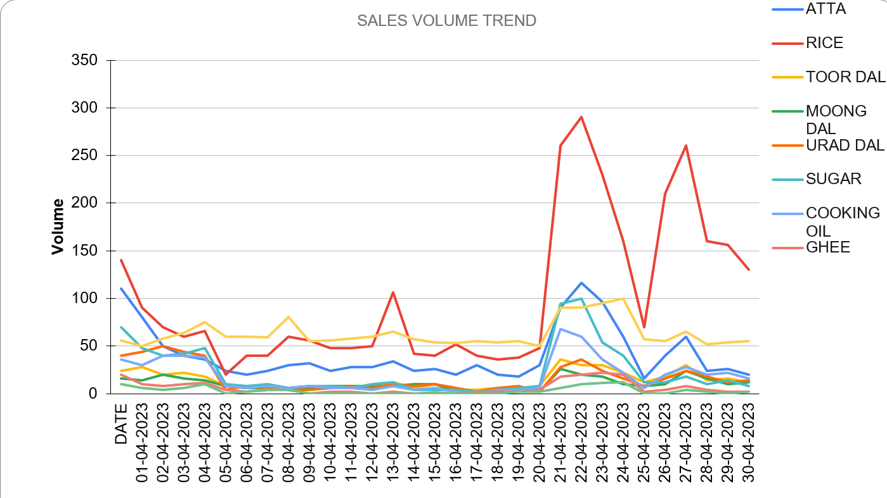
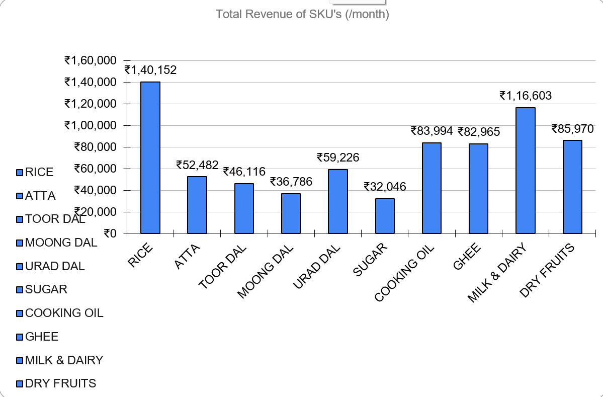
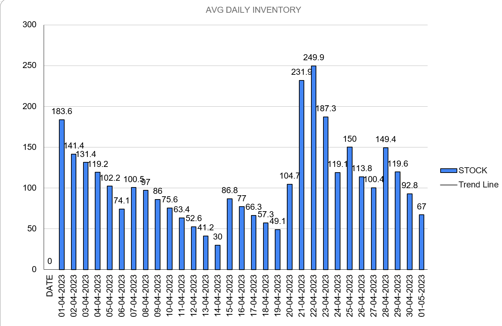
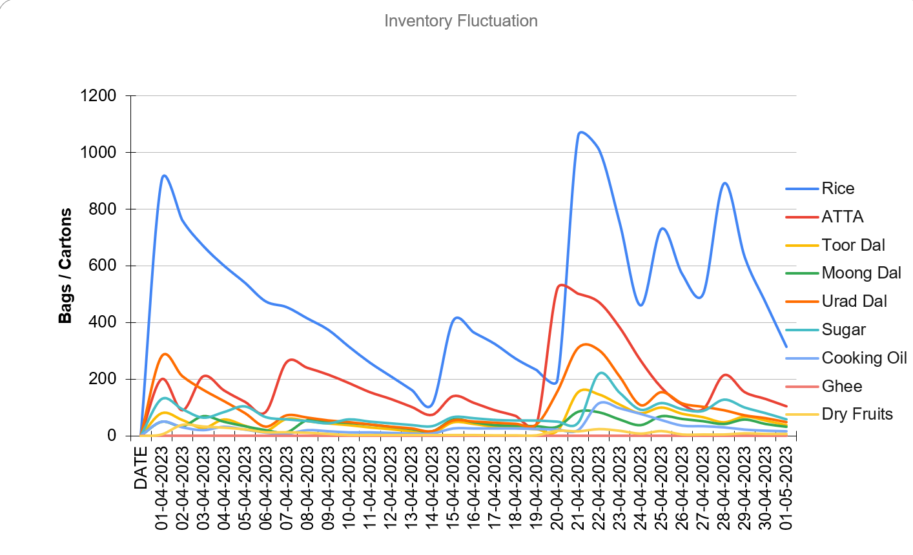
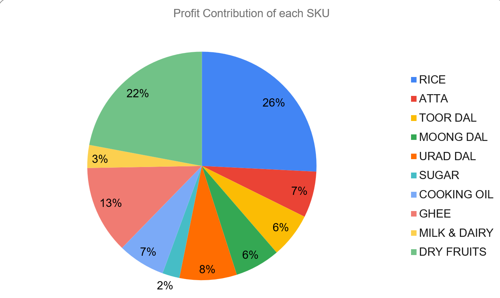
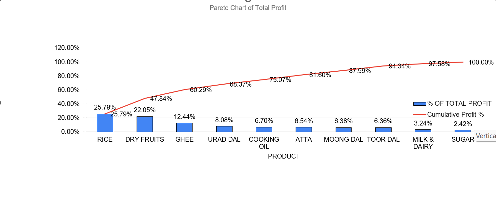

# Business-Data-Management-Project-IITM
# Kirana Store - Business Data Management Project

## Table of Contents

1. [Project Overview](#project-overview)
2. [Project Structure](#project-structure)
3. [Analysis Process](#analysis-process)
   - [Data Collection](#data-collection)
   - [Data Cleaning](#data-cleaning)
   - [Sales and Purchase Analysis](#sales-and-purchase-analysis)
   - [Inventory Management](#inventory-management)
   - [Profit Analysis](#profit-analysis)
4. [Key Findings](#key-findings)
5. [Recommendations](#recommendations)
6. [Conclusion](#conclusion)
7. [Important Links](#important-links)
8. [Sample Visuals](#sample-visuals)

---

## Project Overview

This project is a comprehensive case study focusing on **Gupta Kirana Store**, a medium-sized general store that encountered challenges related to profit margins, sales fluctuations, and inefficient inventory management. The project involves data-driven decision-making using sales and purchase data collected over a period of 31 days, with the goal of improving profitability and operational efficiency.

---

## Project Structure

The project is divided into several phases, starting from **data collection** and ending with **recommendations**. This flow ensures a structured approach toward improving the business:

1. **Data Collection**: Collecting daily sales and purchase data.
2. **Data Cleaning**: Cleaning and organizing the data.
3. **Analysis**: Performing sales, expenditure, profit, and inventory analysis.
4. **Insights**: Identifying key trends and problem areas.
5. **Recommendations**: Providing actionable insights to improve business outcomes.

---

## Analysis Process

### 1. Data Collection

Data was collected daily from the store over a period of 31 days. The data includes:

- Sales data for 10 key SKUs (Stock Keeping Units).
- Purchase data (quantity and cost).
- Daily revenue and expenditure tracking.
- Inventory stock levels for each SKU.

---

### 2. Data Cleaning

Data collected was in a raw and unstructured format. The following steps were undertaken for cleaning and preprocessing the data:

- **Imputation** of missing values.
- **Correcting typing errors**.
- **Sorting and organizing** data into a structured format using Microsoft Excel.

This cleaned dataset allowed for smoother analysis of trends and patterns.

---

### 3. Sales and Purchase Analysis

We analyzed sales and purchase data using formulas and Excel tools:

- **Daily Revenue**: Calculated using `Selling Price * Sales Quantity`.
- **Daily Expenditure**: Calculated using `Purchase Price * Purchase Quantity`.

Analysis revealed fluctuations in revenue and expenditure, with peak sales occurring between the 22nd and 28th of each month. Certain products, such as **Rice, Milk, Cooking Oil, and Ghee**, contributed to over 80% of the store's revenue.

 

---

### 4. Inventory Management

The store faced significant challenges in inventory management. Key findings include:

- High fluctuations in inventory levels, especially during peak sales periods (22nd - 28th).
- Inefficient restocking practices leading to stockouts or overstocking.

Inventory analysis was done using the formula:  
`Inventory (Day i) = Initial Inventory + Purchases - Sales`

---

### 5. Profit Analysis

Profit calculations were made based on the daily sales and purchase data:

- **Profit** was calculated using the formula: `Profit = Sales - Purchase`.
- A **Pareto analysis** was performed, showing that 80% of the profits came from key items like **Dry Fruits, Ghee, Rice**, and **Urad Dal**.

Profit analysis identified wrong purchase decisions on key items like **Cooking Oil** and **Urad Dal**, leading to significant profit losses during high sales periods.

---

## Key Findings

- **High Revenue Days**: Sales spike between the 22nd and 28th of each month.
- **Top Products**: **Rice, Ghee, Milk, Cooking Oil**, and **Dry Fruits** account for the majority of sales and profits.
- **Inventory Issues**: Stockouts and overstocking are frequent during peak periods.
- **Purchase Timing**: Wrong purchase decisions, particularly with **Cooking Oil** and **Urad Dal**, led to significant losses.

---

## Recommendations

### 1. Increase Sales of High-Profit Items

- Focus on high-margin items like **Dry Fruits** and **Ghee** by offering bulk sales and discounts.
- Launch seasonal promotions for items like **Dry Fruits**, especially during winter.

### 2. Optimize Milk Sales

- Concentrate on **morning sales** of milk, as 98% of the milk sales occur during this period.
- Offer home delivery services to increase sales, similar to successful models like **Supr Daily**.

### 3. Restock Inventory Before Peak Periods

- Ensure timely restocking before the high sales period (22nd - 28th).
- Avoid last-minute restocking, which leads to poor purchasing decisions.

### 4. Improve Current Ratio

- Focus on increasing current assets (inventory and cash) to improve liquidity.
- Implement better financial management practices to reduce liabilities.

### 5. Effective Pricing Strategies

- **Bundle Pricing**: Combine related items like **Dry Fruits and Ghee** at discounted rates.
- **Promotional Pricing**: Create time-sensitive offers to increase sales during off-peak periods.

---

## Conclusion

This project provides a comprehensive analysis of **Gupta Kirana Store's** sales, inventory, and financial performance. By implementing the recommended strategies, the store can significantly improve its profitability and inventory management, leading to more sustainable business operations.
